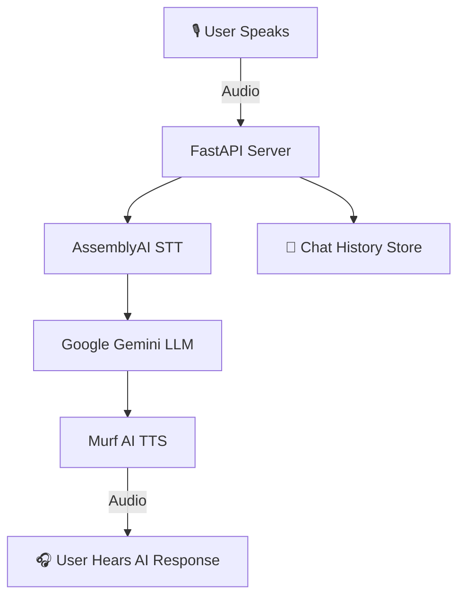

# 🎤 Vocalix — Conversational AI Voice Agent

Imagine chatting with a super-smart friend who listens, understands, and replies in a natural voice. It even remembers past conversations — mention your dog once, and it might ask about them later. I designed it to feel like talking to a person, not just using an app.

_Part of my_ **#30DaysOfVoiceAgents** _challenge — building an end-to-end AI-powered voice assistant that feels natural, responsive, and production-ready._

---

## 📌 Overview

Vocalix is a **dual-mode Voice AI application** designed for real-time, human-like interactions.

- **Voice Agent Assistant (Text-to-Speech)** — Type anything, choose a voice, and instantly hear it in a lifelike tone.
- **Conversational Voice Bot (LLM + TTS)** — Speak naturally, let the AI transcribe, think, and respond in a natural-sounding voice.

It’s built for **speed**, **clarity**, and **engagement** — from the **glassmorphic UI** to the **seamless speech pipeline**.

---

## ✨ Features

- 🎙 **Single Smart Record Button** — Start/Stop recording with one tap, animated for intuitive feedback.
- ⏱ **Live Recording Timer** — Shows how long you’ve been speaking.
- 🔊 **Auto-Playback** — AI responses play instantly without manual clicks.
- 🧠 **Full AI Pipeline**:
  1. 🎤 **Voice Input** — Browser Recording API
  2. ✍ **AssemblyAI** — Real-time transcription (Speech-to-Text)
  3. 💬 **Google Gemini** — Conversational reasoning (LLM)
  4. 🔉 **Murf AI** — Human-like speech generation (Text-to-Speech)
- 💾 **Chat History Memory** — Maintains session-wise context between user and AI.

---

## 🗓️ Day 1 – Kickoff

🚀 Started the Murf AI Voice Agent Challenge
💻 Set up FastAPI project & tested Murf API
🎉 Generated first TTS audio successfully

## 🗓️ Day 2 – TTS Integration

🔗 Linked Murf TTS API with FastAPI
🎧 Built UI for text input & playback
🛠️ Completed end-to-end TTS with error handling

## 🗓️ Day 3 – Voice Agent UX

🖌️ Polished the UI with improved design (HTML/CSS)
🔄 Refactored API flow for smoother UX
💡 Learned how to make the voice interaction feel more natural
🙌 Thanked Murf AI publicly for enabling student creativity

## 🗓️ Day 4 – Echo Bot 🎤

🪞 Added Echo Bot UI section
🎙️ Used MediaRecorder API to record & play audio
🧠 Learned real-time browser audio handling
✨ Built foundation for future speech input

## 🗓️ Day 5 – Audio Upload & Integration ☁️

⏺️ Enabled Echo Bot to send recordings to FastAPI
🛠️ Added /upload API to save audio & return details
🔔 UI now shows live upload status
🔃 Achieved smooth mic → server → playback flow

## 🗓️ Day 6 – Transcription ✍️

🧵 Added /transcribe/file endpoint with AssemblyAI
📤 Audio upload now returns text
🖥️ Integrated transcription display in UI
📜 Complete flow: record → upload → transcribe → show text

## 🗓️ Day 7 – Voice-to-Voice 🎤🔄🎙️

🆕 Added /tts/echo endpoint
🎙️ Flow: record → transcribe (AssemblyAI) → Murf TTS → return audio URL
🔄 Complete voice-to-voice pipeline now live

## 🗓️ Day 8 – LLM Query Endpoint 🧠💬

🆕 Added /llm/query in FastAPI
📩 Sends text to Google Gemini & returns AI reply
⚡ Using gemini-2.5-pro for fast responses
🛠️ Added helper & error handling
💡 First step toward natural conversational AI

## 🗓️ Day 9 – Audio-to-Audio AI Chat 🎤🤖🎙️

🔄 /llm/query now accepts audio from browser
📋 Flow: record → transcribe (AssemblyAI) → Gemini reply → Murf TTS → return audio
🎧 AI responds instantly with lifelike voice
✨ No text input needed — full voice conversation

## 🗓️ Day 10 – Chat Memory 🗂️🗣️

🧠 Added context so AI remembers past messages
🆕 /agent/chat/{session_id} handles audio with session history
📋 Flow: record → transcribe → store in memory → Gemini reply → Murf TTS → return audio
🎯 Enables smooth, context-aware voice conversations

## 🗓️ Day 11 – Robust Error Handling 🛡️⚙️

🔒 Wrapped STT (AssemblyAI), LLM (Gemini), and TTS (Murf) calls in try/except blocks
🆕 Added clear error messages in the UI
🔊 Implemented fallback audio responses so the bot still “speaks” even when an API fails
🛠️ Simulated API failures by disabling API keys to test resilience
🖌️ Styled error messages for better visibility in the chat

## 🗓️ Day 12 – Conversational Agent UI Revamp 🎨🖥️

Gave my AI Voice Agent a fresh, modern look:
✨ Merged “Start Recording” + “Stop Recording” into one smart toggle button
✨ Hidden the audio player — audio now plays automatically after loading
✨ Gradient theme & transparent container
✨ Animated, prominent record button
✨ Clean, focused conversational UI

---

## 🛠 Tech Stack

**Frontend:** HTML, CSS, JavaScript (Vanilla JS)  
**Backend:** Python (FastAPI)  
**Speech-to-Text:** [AssemblyAI](https://www.assemblyai.com/)  
**LLM:** [Google Gemini API](https://ai.google.dev/)  
**Text-to-Speech:** [Murf AI](https://murf.ai/)  
**Runtime:** Python 3.9+  
**Hosting:** Local / Any cloud platform (optional)

---

## 🏗 Architecture



---

# 🛠 Installation & Run Instructions

## 📂 Project Structure

```
MURF-AI-AGENT/
│
├── main.py                     # Main FastAPI application
├── schemas.py                  # Pydantic models for request/response
├── debug_utils.py             # Debugging utilities
├── requirements.txt           # Python dependencies
├── .gitignore                # Git ignore rules
├── README.md                 # Project documentation
│
├── services/                 # Business logic services
│   ├── __init__.py          # Service exports
│   ├── stt_service.py       # Speech-to-Text service (AssemblyAI)
│   ├── tts_service.py       # Text-to-Speech service (Murf)
│   ├── llm_service.py       # Large Language Model service (Gemini)
│   └── chat_service.py      # Chat session management service
│
├── static/                  # Static files
│   ├── favicon_io/
│   │   └── favicon.ico
│   ├── css/
│   │   └── style.css
│   └── js/
│       └── script.js
│
└── templates/               # HTML templates
    └── index.html          # Main web interface
```

## ⚙️ Environment Variables

Create a .env file in the root directory:

```
ASSEMBLYAI_API_KEY=your_assemblyai_api_key
GEMINI_API_KEY=your_gemini_api_key
MURF_API_KEY=your_murf_api_key
```

## 🚀 How to Run

### 1️⃣ Clone the Repository

```
git clone https://github.com/jaikh316/vocalix-voice-agent.git
cd vocalix-voice-agent
```

### 2️⃣ Set Up Python Environment

```
python -m venv venv
source venv/bin/activate  # On Windows: venv\Scripts\activate
```

### 3️⃣ Install Dependencies

```
pip install -r requirements.txt
```

### 4️⃣ Set Environment Variables

Create .env file as described above.

### 5️⃣ Run the Server

```
uvicorn main:app --reload
```

### 6️⃣ Open in Browser

```
http://127.0.0.1:8000
```

---

## 🙌 Acknowledgements

**AssemblyAI** — STT

**Google Gemini** — LLM

**Murf AI** — TTS

**FastAPI** — Backend Framework

---
